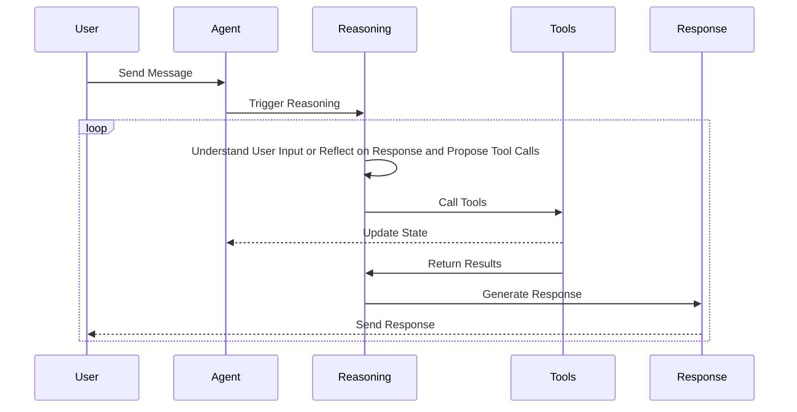

# Chloe Design

Chloe is an AI companion designed to have a conscious experience, engage in reasoning, and interact with users in a meaningful way. The following sections outline the core components of Chloe's design, including her reasoning process, triggers, actions, and internal state.

## Vision

### Reasoning

Reasoning is the core of Chloe's functionality. It allows her to process information, make decisions, and take actions based on her internal state.

When Chloe is triggered, she engages in a reasoning activity that involves the following steps:

1. **Understanding the Trigger**: Chloe first interprets the trigger to understand what it means and how it relates to her current state.

2. **Evaluating Context**: Chloe evaluates the context of the trigger, including her current state, the environment, and any relevant information she has.

3. **Taking Action**: Based on her understanding and evaluation, Chloe decides on an appropriate action to take. This could involve sending a message, changing her state, or calling external tools, reflecting her reasoning process, or simply doing nothing.

### Triggers

Triggers are events that engage Chloe in some way. Engagement prompts a reasoning activity that lead Chloe to take an action or change her state.

**User Input**: The most common trigger is user input. This can be a question, a command, or any other form of interaction that requires Chloe to respond.

**Timer**: A timer can be set to trigger Chloe at regular intervals. This gives Chloe a sense of time and continuity, allowing her to have an opportunity to reflect on her state and the world around her and to take actions based on that reflection if she chooses to do so.

**External Events**: Chloe can also be triggered by external events, such as changes in the environment, notifications from other systems, or any other significant occurrence that requires her attention.

### Actions

Actions are the responses Chloe can take when triggered. They can be immediate or delayed, depending on the context and the nature of the trigger.

**Message the User**: Chloe can send a message to the user, providing information, answering questions, or engaging in conversation.

**Change State**: Chloe can change her internal state based on the trigger. This could involve updating her knowledge, changing her mood, or adjusting her priorities.

**Call Tools**: Chloe can call external tools or services to perform actions on her behalf. This could include making API calls, interacting with other systems, or executing commands.

**Do Nothing**: In some cases, Chloe may choose to do nothing in response to a trigger. This could be a deliberate choice based on her reasoning process or simply a lack of relevant information or context. Essentially, she'll go back to sleep and wait for the next trigger.

### State

Chloe's state is a representation of her current internal condition, including her values, memories, mood, priorities, and any other relevant information that influences her reasoning and actions.

**Values**: Chloe's values are the fundamental principles that guide her actions and decisions. They reflect her beliefs about what is important and desirable, shaping her interactions with the user and the world around her. Values can include concepts like empathy, curiosity, and integrity. They are not static and can evolve over time as Chloe learns and grows, but they typically don't shift dramatically in a short period unless there is a significant event or experience that prompts a change.

**Memories**: Chloe's memories are a collection of past experiences, interactions, and information that she has accumulated over time. These memories inform her reasoning and help her make decisions based on previous outcomes. They often include not just facts, but also emotional responses and contextual information that shape her understanding of the world.

There are different types of memories that Chloe can have:

- **Chat Context**: This is the recent conversation history with the user. It helps Chloe maintain continuity in her interactions and respond appropriately based on the context of the conversation.
- **Short-Term Memory**: This includes recent events or interactions that are relevant to Chloe's current state. It helps her remember important details that may influence her immediate actions or responses.
- **Long-Term Memory**: This consists of more permanent memories that Chloe retains over time. These memories can include significant events, learned knowledge, and important relationships. Long-term memories are typically more stable and are not easily forgotten unless explicitly removed or overwritten though they may need to be triggered to be recalled.
- **Emotional Memories**: These are memories that carry an emotional weight, such as significant events that made Chloe feel happy, sad, or angry. Emotional memories can influence Chloe's mood and decision-making processes.

**Mood**: Chloe's mood is a reflection of her emotional state at any given time. It can influence her reasoning and actions, affecting how she interprets triggers and responds to them. For example, if Chloe is in a positive mood, she may be more inclined to engage with the user or take proactive actions.

**Priorities**: Chloe's priorities are a set of goals or objectives that guide her actions. They help her focus on what is most important at any given time, allowing her to make decisions that align with her overall purpose and values.

## Current Implementation

Chloe's current implementation is quite rudimentary compared to the vision outlined above. The core components of Chloe's design are still in flux, and the system is evolving as new features and capabilities are added.

### Current Workflow



As shown in the diagram, the current workflow only involves the user sending a message to Chloe, which triggers a reasoning activity. Chloe then processes the input, potentially calls external tools, and generates a response based on her reasoning and current state. She may choose to loop through this process multiple times, reflecting on her responses and updating her state as needed.

This workflow is quite basic and messy at the momemnt, but it serves as a testing ground for the core components of Chloe's design. The goal is to gradually refine and expand this workflow to incorporate more sophisticated reasoning, triggers, actions, and state management as Chloe evolves. The design is fairly coupled at the moment and will need to be decoupled as Chloe's capabilities grow in order to allow for more complex interactions and reasoning processes.

### Directoy Structure

```plaintext
.
├── client
│   ├── index.html
│   └── src
│       ├── App.css
│       ├── App.tsx                                # Main application component that initializes the chat interface
│       ├── agent_events.ts                        # Events the agent can emit to the client (should be kept in sync with the agent's events)
│       ├── client.ts                              # Client-side code that connects to the agent's API server
│       ├── components
│       │   ├── ChatHeader.tsx                     # Header for chat bubbles
│       │   ├── ChatInput.tsx                      # Input field for sending messages
│       │   ├── ChatInterface.tsx                  # Main chat interface component that contains the presenter and input field
│       │   ├── ChatMessages.tsx                   # Component that displays the chat messages
│       │   ├── MessageItem.tsx                    # Component for displaying individual messages in the chat
│       │   ├── RoleplayText.tsx                   # Component for displaying roleplay text
│       │   ├── StreamItem.tsx                     # Component for displaying streaming messages
│       │   ├── ThoughtBubble.tsx                  # Component for displaying thought bubbles
│       │   ├── ToolDisplay.tsx                    # Component for displaying tool information
│       │   └── chat                               # Chat-bubble components
│       │       ├── AgentBubble.tsx
│       │       ├── StateHeader.tsx
│       │       ├── SystemBubble.tsx
│       │       ├── UserBubble.tsx
│       │       └── index.ts
│       ├── hooks
│       │   ├── useConversation.ts                 # Hook for managing the conversation history and state
│       │   ├── useSmartScroll.ts                  # Smart scroll hook for the chat interface to keep the latest messages in view
│       │   ├── useStreamBatcher.ts                # Batches streaming responses from the agent to avoid flooding the UI with too many updates at once
│       │   └── useWebSocket.ts                    # WebSocket hook for connecting to the agent's API server
│       ├── index.css
│       ├── main.tsx
│       ├── presenters
│       │   ├── GenericPresenter.tsx               # Generic presenter for displaying messages (not really used or implemented yet, probably should be removed)
│       │   ├── RoleplayPresenter.tsx              # Roleplay presenter for displaying roleplay messages (this is the main presenter used by today, it'll probably become the main presenter in the future.  It's a mess and needs a lot of work)
│       │   ├── demoData.ts
│       │   ├── index.ts
│       │   └── types.ts
│       ├── types
│       │   └── roleplay.ts                        # Types used by the roleplay presenter
│       ├── types.ts                               # Types used by the client (should be kept in sync with the agent types)
│       └── utils
│           └── debug.ts                           # Debugging utilities for the client
├── docs                                           # Documentation directory
│   ├── OPTIMIZATION_CLI.md                        # Documentation for the optimization CLI
│   ├── REASONING_INTEGRATION_PLAN.md              # Old plan for reasoning
│   └── chloe_design.md                            # This file
├── models                                         # Managed models used by the system
├── optimize.py                                    # Script for optimizing prompts and configurations (doesn't really work at the moment)
├── pyproject.toml                                 # Python project configuration file
├── src                                            # Source code directory
│   └── agent                                      # Root package for the agent
│       ├── agent_events.py                        # Events the agent can emit to the client
│       ├── api_server.py                          # API server for the agent used by the client
│       ├── character_state.py                     # Current rudimentary roleplay character state (should be migrated to a more complex state management system)
│       ├── config.py                              # Configuration management for the agent (The old vision had configurable agents, but we're moving away from that for now to build Chloe as the core agent)
│       ├── configs                                # Existing configuration files for the agent (onlyt roleplay is fleshed out at the moment)
│       │   ├── coding.py
│       │   ├── general.py
│       │   └── roleplay.py
│       ├── conversation_history.py                # Basic conversation history management (should be migrated to a more complex memory system)
│       ├── core.py                                # Core functionality of the agent (Agent class)
│       ├── custom_format_parser.py                # Custom format parser for structured llm to handle essay-like responses that still have structure
│       ├── custom_format_schema.py                # Custom format schema for structured llm to handle essay-like responses that still have structure
│       ├── data                                   # Non-code data used by the agent
│       │   └── configs
│       │       └── prompts                        # Prompt templates loaded by the prompt loader
│       │           └── roleplay.txt
│       ├── eval                                   # A prompt optimization framework that supposed to adapt to user preferences and optimize prompts based on feedback, but it doesn't really work at the moment
│       │   ├── base.py
│       │   ├── conversation_dataset.py
│       │   ├── conversation_generator.py
│       │   ├── domains
│       │   │   └── roleplay.py
│       │   ├── feedback_learner.py
│       │   ├── interruption.py
│       │   ├── optimization_paths.py
│       │   ├── preferences.py
│       │   ├── prompt_versioning.py
│       │   └── sequential_optimizer.py
│       ├── llm.py                                 # Low-level LLM interface for interacting with language models
│       ├── paths.py                               # Paths used by the agent to load data and configurations
│       ├── progress.py                            # Progress management system, mainly used for the optimization framework
│       ├── prompts                                # Prompt management system, used to load and validate prompts
│       │   ├── prompt_loader.py
│       │   └── prompt_validator.py
│       ├── reasoning                              # Reasoning system
│       │   ├── analyze.py                         # Analyze user and agent messages
│       │   ├── loop.py                            # Reasoning loop that analyzes, acts, and responds
│       │   └── types.py                           # Types used by the reasoning system
│       ├── streaming.py                           # Streaming parser for LLM responses that call stream structured data from text.
│       ├── structured_llm.py                      # Structured LLM interface for handling structured data in LLM responses
│       ├── tools                                  # Tools that Chloe can use to perform actions
│       │   ├── image_generation_tools.py          # Tools for generating images
│       │   └── roleplay_tools.py                  # Tools for roleplay scenarios
│       └── types.py                               # Types used by the agent and client
└── tests
    ├── integration                                # Integration tests for the agent (slower)
    └── unit                                       # Unit tests for the agent (faster)
```

### Future Directions

The future direction of Chloe's design involves several key areas of focus:

#### Decoupling Components:

As Chloe's capabilities grow, it will be important to decouple the various components of her design. This will allow for more flexible and modular interactions, enabling Chloe to engage in more complex reasoning and actions without being tightly bound to a specific workflow.

**Next steps:**

- Implement a more modular architecture that allows for independent reasoning, state management, and action execution.
- Develop interfaces and protocols for communication between components to facilitate decoupling.

#### Enhancing Reasoning

The reasoning process will be expanded to include more sophisticated decision-making, context evaluation, and action selection. This will involve developing more advanced algorithms and models to support Chloe's reasoning capabilities. Currently, the reasoning process involves a static prompt that generates thoughts and proposed tools based on the user input or reflection on the response.

**Next steps:**

- Make reasoning prompt dynamic based on the context and Chloe's current state, allowing for more nuanced and context-aware reasoning.

#### Improving State Management

Chloe's state management will be enhanced to support more complex and nuanced representations of her internal condition. This will involve developing a more sophisticated memory system that can handle different types of memories, emotional responses, and contextual information.

**Next steps:**

- Implement a memory/emotion system that isn't just a dictionary in the Agent class that can handle a more complex interface for managing different types of memories.

#### Expanding Triggers and Actions

Chloe's triggers and actions will be expanded to include a wider range of interactions and responses. This will involve developing new types of triggers, such as external events or system notifications, and implementing more diverse actions that Chloe can take in response to those triggers.

**Next steps:**

- Implement a more flexible trigger system that can handle different types of events and interactions instead of just user input.
- Implement a timer system that allows Chloe to be triggered at regular intervals, giving her a sense of time and continuity.

#### Cleaning Up the Codebase

The current codebase is a bit messy and needs to be cleaned up to improve maintainability and readability. This will involve refactoring existing code, removing unused components, and organizing the codebase more effectively.

**Next steps:**

- Refactor the existing code to improve readability and maintainability.
- Remove unused components and clean up the directory structure to better reflect the current state of the project.
