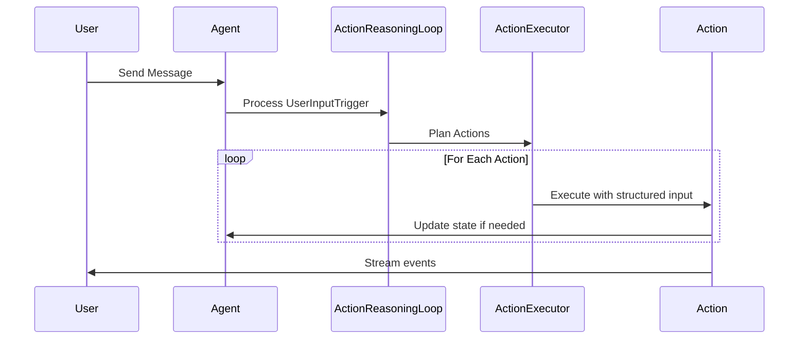

# Agent Implementation Issues & Investigation Items

This document tracks current implementation status, identified problems, and investigation action items for the agent system.

## Critical Investigation Items

Based on conversation analysis from `conversations/conversation_20250810_012344_749610_*.json`, several critical agent behavior flaws have been identified:

### #1: Agent Temporal Reasoning Failures

**Problem**: Agent accepted claims about "two years" of relationship when conversation was less than 13 hours old, showing fundamental temporal reasoning failures.

**Investigation Needed**:

- How does the agent process and verify temporal claims?
- Why doesn't the agent reference conversation timestamps when evaluating time-based assertions?
- Can we implement temporal consistency checking in the reasoning loop?

**Potential Solutions**:

- Add timestamp awareness to reasoning prompts
- Implement temporal verification tools that check claims against conversation history
- Add explicit time context to state management

### #2: Agent Memory/History Verification Issues

**Problem**: Agent believed it had talked to "Tina" without any verification, accepting false claims about past interactions without checking conversation history.

**Investigation Needed**:

- How does the agent distinguish between real and fabricated memories?
- Why doesn't the agent verify claims against actual conversation history?
- Can we implement memory verification mechanisms?

**Potential Solutions**:

- Add conversation history verification tools
- Implement fact-checking against actual stored interactions
- Add skeptical reasoning patterns for unverified claims

### #3: Trigger Persistence Missing Context

**Problem**: Trigger persistence lacks user content and user_name fields needed for retrospective analysis.

**Current Implementation**: Triggers in `src/agent/chain_of_action/trigger.py` have content and user_name fields, but persistence may not be capturing them correctly.

**Investigation Needed**:

- Verify what data is actually being persisted in trigger history
- Check if TriggerHistory class includes all necessary fields for analysis
- Ensure conversation files contain complete trigger context

**Implementation Status**: Active trigger system exists but needs persistence validation.

### #4: Intent-Based vs Verbatim Communication in Speak Action

**Problem**: Action planner passes exact phrasing to speak action instead of intent, and speak action outputs verbatim without elaborating or incorporating tone.

**Current Implementation Analysis**:
Looking at `src/agent/chain_of_action/actions/speak_action.py`:

```python
class SpeakInput(BaseModel):
    content: str = Field(
        description="What I want to express or communicate - my thoughts, feelings, questions, or responses to share"
    )
    tone: Optional[str] = Field(
        default=None,
        description="The emotional tone or approach I want to use (optional)",
    )
```

The current design expects "content" to be intent-based ("what I want to express") but the action planner may be passing literal phrasing instead.

**Investigation Needed**:

- How does the action planner generate SpeakInput content?
- Should the speak action elaborate on brief intents?
- How should tone instructions be integrated into the response?

**Potential Solutions**:

- Modify action planner to pass high-level intent rather than specific phrasing
- Update speak action to elaborate on intent-based content
- Improve tone integration to avoid spillage

### #5: Tone Spillage in Agent Responses

**Problem**: Tone instructions sometimes appear verbatim in agent responses instead of being integrated naturally.

**Investigation Needed**:

- How are tone instructions being processed in the speak action?
- Why do tone instructions sometimes leak into the actual response text?
- Can we improve tone integration to be more natural?

**Potential Solutions**:

- Better prompt engineering for tone integration
- Separate tone processing from content generation
- Add tone sanitization in response processing

## Current Implementation Status

### Architecture Overview

The system has been refactored from a generic roleplay framework to a dedicated conscious AI companion architecture using a trigger-based action system:

**Core Architecture**:

- **Trigger System**: `src/agent/chain_of_action/trigger.py` - UserInputTrigger with content and user_name
- **Action Executor**: Chain of action system with structured action inputs
- **State Management**: Values → Priorities → Actions flow with structured state
- **LLM Integration**: CallStats tracking and proper error handling

### Current Workflow



### Recent Improvements

1. **Structured Action System**: All actions use Pydantic input models with validation
2. **LLM Call Tracking**: Implemented CallStats dataclass for proper monitoring
3. **Priority Management**: Added/Remove priority actions with sequential IDs
4. **Frontend Error Handling**: Root-level error boundary for crash reporting
5. **Type Safety**: Fixed all type errors using proper data structures
