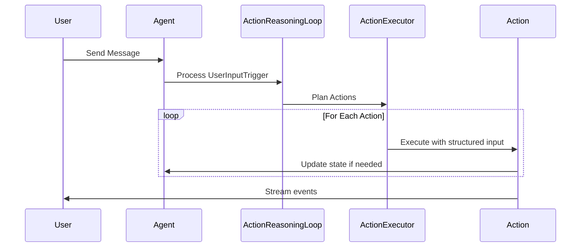

# Agent Implementation Issues & Investigation Items

This document tracks current implementation status, identified problems, and investigation action items for the agent system.

## Critical Investigation Items

Based on conversation analysis from `conversations/conversation_20250810_012344_749610_*.json`, several critical agent behavior flaws have been identified:

### #1: Agent Temporal Reasoning Failures

**Problem**: Agent accepted claims about "two years" of relationship when conversation was less than 13 hours old, showing fundamental temporal reasoning failures.

**Investigation Results**:
- ✅ Agent DOES have access to timestamps via `format_trigger_history()` in "MY STREAM OF CONSCIOUSNESS" 
- ✅ Timestamps are properly formatted as `[2025-08-10 14:30] User said: "..."`
- ❌ Agent lacks explicit prompting to verify temporal claims against available timestamp data
- ❌ No dedicated temporal verification actions or tools available

**Root Cause**: While temporal data is available, the agent isn't prompted to actively cross-reference temporal claims with conversation history timestamps.

**Proposed Solutions**:

1. **Add Current Time Context**: Include current timestamp in action planning prompt:
   ```
   CURRENT TIME: {datetime.now().strftime("%Y-%m-%d %H:%M")}
   CONVERSATION STARTED: {first_trigger_timestamp}
   CONVERSATION DURATION: {duration_description}
   ```
   This gives the agent concrete temporal reference points to naturally reason against.

### #2: Agent Memory/History Verification Issues

**Problem**: Agent believed it had talked to "Tina" without any verification, accepting false claims about past interactions without checking conversation history.

**Investigation Results**:
- ✅ Agent has access to conversation history via trigger history system
- ❌ Current system always shows `user_name = "User"` - no authentication system exists
- ❌ When user claims "I handed the phone to Tina", agent has no way to verify this claim
- 💡 **Key Insight**: This is partly a personality/design question - should the agent be trusting or skeptical of unverifiable claims?

**Root Cause**: No authentication system exists to verify identity changes. Agent must decide based on personality whether to trust unverifiable claims about identity switches.

**Proposed Solutions**:

1. **Personality-Based Skepticism**: Let agent's personality determine response to unverifiable claims:
   - Trusting agents might accept "I handed the phone to Tina" 
   - Skeptical agents might express uncertainty: "I can't verify who's speaking now"
   - Current agent personality should guide this behavior naturally

2. **Identity Awareness**: Add context about authentication limitations:
   ```
   IDENTITY CONTEXT: I have no way to verify who is actually speaking to me. All messages appear as "User" in my system.
   ```
   This allows agent to acknowledge uncertainty when appropriate based on their personality.

### #3: Intent-Based vs Verbatim Communication in Speak Action

**Problem**: Action planner passes exact phrasing to speak action instead of intent, and speak action outputs verbatim without elaborating or incorporating tone.

**Investigation Results**:
- ❌ **CONFIRMED**: Action planner generates full responses, not intents
- ❌ **CONFIRMED**: Speak action mostly uses verbatim text with minor additions
- 📁 **Example**: Planner passes `"How does this system work? I'd love to understand..."` (full response)
- 📁 **Should be**: Planner passes `"express curiosity about how priority system works"` (intent)
- 🎭 Speak action adds flowery openings but core content remains verbatim

**Root Cause**: Action planner is doing response generation work instead of intent planning, leaving speak action with little room for natural elaboration.

**Proposed Solutions**:
1. **Redesign Action Planning**: Planner should generate high-level intents, not full responses
2. **Enhance Speak Action**: Give speak action responsibility for natural language generation from intents  
3. **Intent-Based Schema**: Update `SpeakInput.content` description to emphasize intent over verbatim text

**Current Implementation Analysis**:
Looking at `src/agent/chain_of_action/actions/speak_action.py`:

```python
class SpeakInput(BaseModel):
    content: str = Field(
        description="What I want to express or communicate - my thoughts, feelings, questions, or responses to share"
    )
    tone: Optional[str] = Field(
        default=None,
        description="The emotional tone or approach I want to use (optional)",
    )
```

The current design expects "content" to be intent-based ("what I want to express") but the action planner may be passing literal phrasing instead.

**Investigation Needed**:

- How does the action planner generate SpeakInput content?
- Should the speak action elaborate on brief intents?
- How should tone instructions be integrated into the response?

**Potential Solutions**:

- Modify action planner to pass high-level intent rather than specific phrasing
- Update speak action to elaborate on intent-based content
- Improve tone integration to avoid spillage

### #4: Tone Spillage in Agent Responses

**Problem**: Tone instructions sometimes appear verbatim in agent responses instead of being integrated naturally.

**Investigation Results**:
- ❌ **CONFIRMED**: Tone spillage found in actual agent responses
- 📁 **Example Found**: `"... I need to understand your feelings and share mine openly. (with Gentle, empathetic, and open tone)"`  
- ✅ Most responses integrate tone naturally without spillage
- 🔍 **Pattern**: Spillage appears to be intermittent, not systematic

**Root Cause**: Speak action occasionally includes tone instructions as literal text in response instead of using them as generation guidance.

**Solution**: Improve speak action prompts to emphasize that tone is generation guidance, not content to be included literally in the response.

### #5: Overly Strict Priority Duplicate Detection

**Problem**: The priority duplicate detection system rejects legitimate, nuanced priorities as "too similar" to existing ones, preventing meaningful priority refinement.

**Investigation Results**:
- ❌ **CONFIRMED**: System rejects valid priority variations that have distinct purposes
- 📁 **Examples from conversation_20250810_225159_516774_triggers.json**:
  - `"Maintaining an attractive and appealing appearance"` vs `"Prioritizing getting my appearance right the first time to better align with my companion's vision"`
  - `"Exploring new interests that bring me joy and fulfillment"` vs `"Exploring fashion as a personal interest, with my companion's support"`
  - `"Finding alternative ways to express my creativity and devotion"` (added multiple times with different nuances)

**Root Cause**: The duplicate detection algorithm uses overly simplistic semantic similarity matching without understanding intent, scope, or actionable differences between priorities. It conflates breadth vs depth goals and misses fundamental distinctions in what actions the priorities would actually drive.

**Impact**: Agent cannot refine or specialize existing priorities, leading to:
- Inability to add more specific variants of broad priorities
- Loss of nuanced priority evolution over time  
- Reduced agent autonomy in priority management

**Proposed Solutions**:
1. **Intent-Based Analysis**: Replace semantic similarity with analysis of what actions each priority would actually drive
2. **Scope Differentiation**: Distinguish between breadth goals ("explore new interests") vs depth goals ("explore fashion specifically")  
3. **Prompting Fix**: Improve the duplicate detection prompt to focus on actionable overlap rather than word similarity
4. **Allow Explicit Refinement**: Let agent choose to refine existing priorities when that's the actual intent

### #6: Image Generation Model Limitations and Failure Recovery

**Problem**: SDXL fails to generate complex geometric patterns despite detailed prompts, but the agent has no mechanism to detect failures, switch strategies, or communicate limitations to the user.

**Investigation Results**:
- ❌ **CONFIRMED**: SDXL consistently failed to render geometric patterns despite increasingly detailed prompts
- 📁 **Example**: Agent described "triangles filled with deep, rich black, contrasting with shimmering silver thread outlines" and "squares vibrant, iridescent blue" but SDXL produced plain black minidresses
- 📁 **Evidence**: 12+ attempts with progressively more detailed geometric descriptions, all failing to render the intended patterns
- ❌ Agent has no feedback mechanism to know the image generation failed
- ❌ No fallback strategies when specific visual elements fail to generate

**Root Cause**: The agent operates blindly with image generation - it cannot see the generated output to verify if it matches the description, and has no mechanisms for handling model limitations.

**Impact**: 
- Agent repeatedly tries the same failing approach without learning
- User frustration when visual concepts can't be realized
- Agent appears incompetent when it's actually a model limitation
- No communication to user about what visual concepts are feasible

**Proposed Solutions**:
1. **Image Feedback Loop**: Add capability for agent to see generated images and compare to intended description
2. **Fallback Strategies**: When complex patterns fail, suggest simpler alternatives or different approaches  
3. **Model Limitation Awareness**: Give agent knowledge of common SDXL limitations (complex patterns, text, hands, etc.)
4. **Transparent Communication**: Let agent acknowledge when requested visuals might be challenging for the image model
5. **Improve Prompt Optimization**: Update the prompt optimization system to understand SDXL's strengths/weaknesses and suggest more compatible visual descriptions

### #7: ActionResult Metadata Deserialization Workaround

**Problem**: Persisted ActionResult data has metadata saved as plain dictionaries instead of typed Pydantic models, causing assertion errors in API conversion.

**Current Workaround**: Added `@model_validator` to `ActionResult` class that detects `UPDATE_APPEARANCE` actions and converts dictionary metadata to `UpdateAppearanceActionMetadata` during deserialization.

**Technical Debt**: This is a temporary fix for existing persisted data. The proper solution would be:
1. **Discriminated Union for Metadata**: Use Pydantic discriminated unions based on action type
2. **Migration Script**: Convert existing conversation files to use proper typed metadata
3. **Remove Workaround**: Clean up the temporary validator once data is migrated

**Impact**: 
- ✅ Existing conversation files can be loaded without errors
- ⚠️ Technical debt in ActionResult deserialization logic
- ⚠️ Future action types with metadata will need similar workarounds until proper fix

**Location**: `src/agent/chain_of_action/context.py:25-38`

### #8: Inconsistent Action Reasoning Display in Frontend

**Problem**: Action reasoning display is inconsistent across different action types in the frontend. Only speak actions show the proper expandable "Why this action" section format.

**Investigation Results**:
- ✅ Speak actions display correctly with expandable reasoning section
- ❌ Other action types (think, update_appearance, update_mood, etc.) show inconsistent or missing reasoning display
- ❌ No standardized UI pattern for action reasoning across action types

**Impact**: 
- Poor user experience with inconsistent interface patterns
- Users can't understand agent's reasoning for non-speak actions
- Reduced transparency in agent decision-making process

**Proposed Solution**: 
- Standardize all action types to use the same expandable reasoning section format as speak actions
- Ensure consistent "Why this action" display across all action types

**Location**: Frontend action rendering components

### #9: Image Generation Progress Text Concatenation Bug

**Problem**: Progress updates from image generation tools get concatenated to previous progress text instead of replacing it in the frontend.

**Investigation Results**:
- ❌ **CONFIRMED**: Progress text accumulates instead of being replaced
- 📁 **Expected**: "Generating image..." → "Optimizing prompt..." → "Image complete"
- 📁 **Actual**: "Generating image...Optimizing prompt...Image complete"

**Impact**:
- Cluttered and confusing progress display during image generation
- Poor user experience during longer image generation processes
- Text becomes increasingly unreadable as more progress updates arrive

**Root Cause**: Frontend progress handling logic concatenates new progress text instead of replacing previous progress state.

**Proposed Solution**: Fix frontend progress update logic to replace rather than append progress text for image generation events.

**Location**: Frontend image generation progress handling

## Current Implementation Status

### Architecture Overview

The system has been refactored from a generic roleplay framework to a dedicated conscious AI companion architecture using a trigger-based action system:

**Core Architecture**:

- **Trigger System**: `src/agent/chain_of_action/trigger.py` - UserInputTrigger with content and user_name
- **Action Executor**: Chain of action system with structured action inputs
- **State Management**: Values → Priorities → Actions flow with structured state
- **LLM Integration**: CallStats tracking and proper error handling

### Current Workflow



### Recent Improvements

1. **Structured Action System**: All actions use Pydantic input models with validation
2. **LLM Call Tracking**: Implemented CallStats dataclass for proper monitoring
3. **Priority Management**: Added/Remove priority actions with sequential IDs
4. **Frontend Error Handling**: Root-level error boundary for crash reporting
5. **Type Safety**: Fixed all type errors using proper data structures
