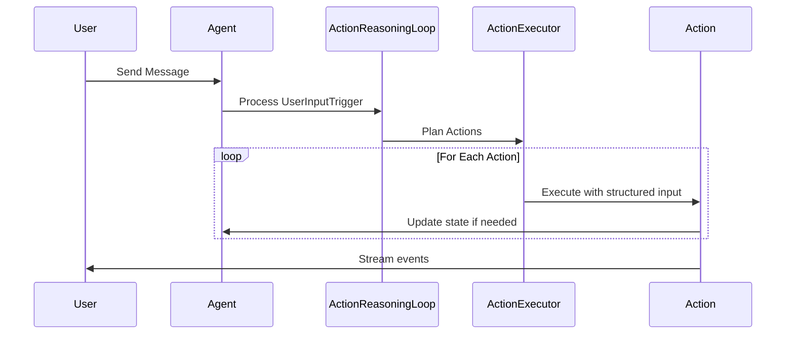

# Agent Implementation Issues & Investigation Items

This document tracks current implementation status, identified problems, and investigation action items for the agent system.

## Critical Investigation Items

Based on conversation analysis from `conversations/conversation_20250810_012344_749610_*.json`, several critical agent behavior flaws have been identified:

### #6: Image Generation Model Limitations and Failure Recovery

**Problem**: SDXL fails to generate complex geometric patterns despite detailed prompts, but the agent has no mechanism to detect failures, switch strategies, or communicate limitations to the user.

**Investigation Results**:

- ❌ **CONFIRMED**: SDXL consistently failed to render geometric patterns despite increasingly detailed prompts
- 📁 **Example**: Agent described "triangles filled with deep, rich black, contrasting with shimmering silver thread outlines" and "squares vibrant, iridescent blue" but SDXL produced plain black minidresses
- 📁 **Evidence**: 12+ attempts with progressively more detailed geometric descriptions, all failing to render the intended patterns
- ❌ Agent has no feedback mechanism to know the image generation failed
- ❌ No fallback strategies when specific visual elements fail to generate

**Root Cause**: The agent operates blindly with image generation - it cannot see the generated output to verify if it matches the description, and has no mechanisms for handling model limitations.

**Impact**:

- Agent repeatedly tries the same failing approach without learning
- User frustration when visual concepts can't be realized
- Agent appears incompetent when it's actually a model limitation
- No communication to user about what visual concepts are feasible

**Proposed Solutions**:

1. **Image Feedback Loop**: Add capability for agent to see generated images and compare to intended description
2. **Fallback Strategies**: When complex patterns fail, suggest simpler alternatives or different approaches
3. **Model Limitation Awareness**: Give agent knowledge of common SDXL limitations (complex patterns, text, hands, etc.)
4. **Transparent Communication**: Let agent acknowledge when requested visuals might be challenging for the image model
5. **Improve Prompt Optimization**: Update the prompt optimization system to understand SDXL's strengths/weaknesses and suggest more compatible visual descriptions

### #7: ActionResult Metadata Deserialization Workaround

**Problem**: Persisted ActionResult data has metadata saved as plain dictionaries instead of typed Pydantic models, causing assertion errors in API conversion.

**Current Workaround**: Added `@model_validator` to `ActionResult` class that detects `UPDATE_APPEARANCE` actions and converts dictionary metadata to `UpdateAppearanceActionMetadata` during deserialization.

**Technical Debt**: This is a temporary fix for existing persisted data. The proper solution would be:

1. **Discriminated Union for Metadata**: Use Pydantic discriminated unions based on action type
2. **Migration Script**: Convert existing conversation files to use proper typed metadata
3. **Remove Workaround**: Clean up the temporary validator once data is migrated

**Impact**:

- ✅ Existing conversation files can be loaded without errors
- ⚠️ Technical debt in ActionResult deserialization logic
- ⚠️ Future action types with metadata will need similar workarounds until proper fix

**Location**: `src/agent/chain_of_action/context.py:25-38`

### #8: Inconsistent Action Reasoning Display in Frontend

**Problem**: Action reasoning display is inconsistent across different action types in the frontend. Only speak actions show the proper expandable "Why this action" section format.

**Investigation Results**:

- ✅ Speak actions display correctly with expandable reasoning section
- ❌ Other action types (think, update_appearance, update_mood, etc.) show inconsistent or missing reasoning display
- ❌ No standardized UI pattern for action reasoning across action types

**Impact**:

- Poor user experience with inconsistent interface patterns
- Users can't understand agent's reasoning for non-speak actions
- Reduced transparency in agent decision-making process

**Proposed Solution**:

- Standardize all action types to use the same expandable reasoning section format as speak actions
- Ensure consistent "Why this action" display across all action types

**Location**: Frontend action rendering components

### #9: Image Generation Progress Text Concatenation Bug

**Problem**: Progress updates from image generation tools get concatenated to previous progress text instead of replacing it in the frontend.

**Investigation Results**:

- ❌ **CONFIRMED**: Progress text accumulates instead of being replaced
- 📁 **Expected**: "Generating image..." → "Optimizing prompt..." → "Image complete"
- 📁 **Actual**: "Generating image...Optimizing prompt...Image complete"

**Impact**:

- Cluttered and confusing progress display during image generation
- Poor user experience during longer image generation processes
- Text becomes increasingly unreadable as more progress updates arrive

**Root Cause**: Frontend progress handling logic concatenates new progress text instead of replacing previous progress state.

**Proposed Solution**: Fix frontend progress update logic to replace rather than append progress text for image generation events.

**Location**: Frontend image generation progress handling


### #11: Image Generation Blocking Process - Poor Streaming UX

**Problem**: SDXL image generation pipeline runs synchronously and blocks the entire Python process, preventing event streaming and creating poor user experience during image generation.

**Investigation Results**:

- ❌ **CONFIRMED**: SDXL pipeline blocks entire process during generation (unlike LLM network requests which yield)
- ❌ **CONFIRMED**: Users see complete freeze during image generation instead of progress updates
- ❌ **CONFIRMED**: No events can be streamed while image generation is running
- 📁 **Impact**: Poor UX especially for longer/complex image generations

**Root Cause**: SDXL pipeline is CPU/GPU intensive synchronous operation that doesn't yield control back to event loop, blocking all other processing.

**Current Workaround**: Image generation sends progress events, but they get queued and delivered in batch after completion rather than real-time.

**Proposed Solution**: **Separate Image Generation Process**

1. **Dedicated Process**: Spawn separate Python process for image generation with pre-loaded SDXL pipeline
2. **IPC Communication**: Use queues/pipes for non-blocking communication between main process and image process
3. **Pipeline Persistence**: Keep SDXL pipeline loaded in separate process to avoid reload overhead
4. **Async Interface**: Main process sends requests and receives progress/results asynchronously
5. **Process Lifecycle**: Start image process on server startup, keep alive for subsequent requests

**Benefits**:

- Unblocked event streaming during image generation
- Real-time progress updates instead of batched delivery
- Better resource isolation between LLM and image generation
- Improved overall system responsiveness

**Implementation Considerations**:

- Process startup/shutdown management
- Error handling across process boundaries
- Memory management for GPU resources in separate process
- Queue sizing and backpressure handling

**Location**: `src/agent/tools/image_generation_tools.py`

### #13: Trigger Summarization Loses Critical Details for Coherence

**Problem**: Agent summarization of trigger entries loses critical details needed for referencing previous actions, thoughts, and statements, harming coherence in follow-up interactions.

**Investigation Results**:

- ❌ **CONFIRMED**: Compressed summaries are overly poetic/flowery and lose concrete details
- ❌ **CONFIRMED**: Missing specific information about actions taken, words spoken, priorities referenced
- ❌ **CONFIRMED**: Agent cannot effectively reference "what I just said/did/thought" due to vague summaries
- 📁 **Example**: Detailed mood update and specific response gets summarized as "heart swell" and "words wrapping around his like a promise"

**Root Cause**: Summarization prompt produces appropriate emotional/poetic voice but fails to preserve concrete facts about what was actually said, thought, and done.

**Impact**:

- Reduced conversational coherence when agent needs to reference recent actions
- Loss of important details about priorities, mood changes, specific statements
- Agent appears to "forget" what it just did or said
- Difficulty maintaining conversation threads that depend on previous context

**Proposed Solutions**:

1. **Fact-Preserving Emotional Narrative**: Keep the poetic/emotional voice but ensure it includes what was actually said, thought, and done
2. **Concrete Detail Integration**: Weave specific words spoken, priorities referenced, and actions taken into the emotional retelling
3. **Improved Summarization Prompt**: Guide agent to include factual content within its natural emotional perspective
4. **Content Coverage Requirements**: Ensure summaries cover key referential details even when filtered through emotional lens

**Example of Current Issue**:

- **Original**: Thanked user, asked "How has your day been?", updated mood to "Affectionate (High)", referenced priority p2
- **Current Summary**: "heart swell, wanting to give that same joy back, words wrapping around his like a promise"
- **Needed**: Same emotional tone but including "I thanked him and asked about his day, feeling my affection deepen..."

**Location**: Trigger summarization system, `conversations/baseline_triggers.json` for examples

### #14: Action Planning Context Staleness - Batch vs Single Planning Tradeoff

**Problem**: Batch action planning (e.g., "think -> update_appearance") requires planning all action inputs upfront, preventing later actions from incorporating context discovered during earlier action execution.

**Investigation Results**:

- ❌ **CONFIRMED**: Later actions in planned sequence cannot benefit from earlier action results
- ❌ **CONFIRMED**: "update_appearance" planned before "think" executes, missing thought-based appearance decisions
- ⚠️ **Workaround**: Think and speak actions get full context in prompts, but this is slow and can't scale to all actions
- 📁 **Tradeoff**: Batch planning (fast) vs single action planning (fresh context) vs full context for all (very slow)

**Root Cause**: Action planner must specify inputs for entire sequence at planning time, before any actions execute and update context.

**Impact**:

- Missed connections between sequential actions (e.g., thought influencing appearance changes)
- Reduced coherence when actions should build on each other
- Workaround complexity with partial full-context solutions
- Performance vs context freshness tradeoffs

**Current Approach**:

- Batch planning for efficiency
- Full context only for think/speak actions
- Other actions use stale planning-time context

**Proposed Solutions**:

1. **Hybrid Planning**: Identify action dependencies and use single planning for dependent sequences
2. **Conditional Re-planning**: Re-plan remaining actions when earlier actions produce significant context changes
3. **Action Result Injection**: Pass previous action results to subsequent actions without full re-planning
4. **Smart Batching**: Group independent actions only, force single planning for dependent chains

**Example Scenario**:

- Plan: "think about outfit preferences -> update_appearance"
- Issue: Appearance update planned before thinking completes, misses thought insights
- Current: Only think/speak get full context workaround
- Needed: Appearance update should incorporate thought results

**Location**: Action planning system, `src/agent/chain_of_action/action_planner.py`

### #16: Multi-Action Image Generation Coordination - Update Environment Design

**Problem**: Implementing `update_environment` action creates complex image generation coordination when both `update_appearance` and `update_environment` are in the same action sequence - each should generate images individually, but together should produce one combined image.

**Investigation Results**:

- 📁 **Simple Case**: `update_environment` alone should generate environment image
- 📁 **Simple Case**: `update_appearance` alone should generate appearance image
- ❌ **Complex Case**: Both in same sequence should generate single combined image, not two separate images
- 🤔 **Design Question**: Should `update_environment` be separate action or integrated into `update_appearance`?

**Root Cause**: No coordination mechanism between actions for shared image generation resources.

**Impact**:

- Potential for redundant/conflicting image generation
- Poor user experience with multiple images when one comprehensive image expected
- Unclear action boundaries when appearance and environment updates interact

**Design Considerations**:

**Option 1: Separate Actions with Coordination**

- Pros: Clean separation of concerns, flexible individual use
- Cons: Complex coordination logic, potential for conflicts
- Implementation: Cross-action communication for image generation batching

**Option 2: Unified Appearance+Environment Action**

- Pros: Single image generation point, no coordination needed
- Cons: Large action scope, less flexible for environment-only updates
- Implementation: Expanded `update_appearance` with optional environment updates

**Option 3: Image Generation Service Deduplication**

- Pros: Actions remain simple, coordination handled at image generation level
- Cons: Complex image service logic, potential timing issues
- Implementation: Smart image generation that combines concurrent requests

**Questions for Resolution**:

1. How would agent naturally think about environment vs appearance updates?
2. Are environment-only updates common enough to justify separate action?
3. Should image generation be smart enough to handle coordination automatically?

**Location**: Future `update_environment` action design, relationship with `update_appearance`

### #17: Action Planning/Execution Abstraction - Combining Planned Actions

**Problem**: Need to decouple agent's logical action planning from optimized execution strategies, allowing multiple planned actions to be combined into efficient execution units while maintaining clean agent reasoning and frontend presentation.

**Use Case**: Agent plans "update_appearance" + "update_environment" but system executes as single combined image generation, returning unified result that can be rendered as one coherent visual update.

**Current State**: Direct 1:1 mapping between planned actions and execution, leading to coordination complexity for related actions.

**Proposed Architecture**:

**Planning Layer**: Agent plans discrete logical actions naturally

- `update_appearance`: "I want to change my outfit"
- `update_environment`: "I want to move to the garden"

**Execution Layer**: System analyzes and optimizes execution

- Detects combinable actions (both generate images)
- Executes single combined image generation
- Handles resource coordination automatically

**Response Layer**: Returns semantic execution results

```json
{
  "action": "visual_update",
  "scope": ["appearance", "environment"],
  "image_url": "combined_scene.jpg",
  "appearance_changes": "...",
  "environment_changes": "...",
  "represents_planned_actions": ["update_appearance", "update_environment"]
}
```

**Benefits**:

- Clean agent reasoning (granular, logical actions)
- Optimized execution (single image generation)
- Flexible frontend rendering (semantic units)
- Extensible to other action combinations

**Implementation Approach**:

- Start with explicit boilerplate for first few combinations
- Let real usage patterns guide abstraction design
- Avoid premature optimization of combination logic

**Considerations**:

- Mapping complexity between planned and executed actions
- Error handling when combined execution fails
- Frontend logic for rendering combined vs individual results
- Maintaining action attribution for user understanding

**Location**: Action execution pipeline, future `update_environment` implementation

### #18: Multi-Pass URL Content Reading for Long Articles

**Problem**: Many web articles exceed the 55kb context budget but contain valuable information throughout. Current single-pass reading truncates long articles mid-content, losing important details that appear later in comprehensive guides.

**Context**: The fetch_url action now successfully extracts clean article content (removing navigation/ads, converting to markdown), but comprehensive articles like "35+ Types of Mini Dresses" still get truncated at 55kb, losing 50%+ of the content.

**Current Workaround**: Truncate at 55kb to reserve context space for instructions and output generation.

**Proposed Solution**: **Iterative Summary Building**

1. **First Pass**: Read initial chunk of article (within 55kb budget), agent creates initial summary
2. **Subsequent Passes**: Read next chunk + show current summary + remaining content indicator
3. **Agent Updates**: Agent refines/expands summary incorporating new information from each chunk
4. **Continue**: Repeat until all content processed, building comprehensive summary incrementally

**Implementation Approach**:

- Chunk article content into 55kb segments (accounting for summary + instruction space)
- Each pass: `current_summary + new_chunk + "More content available: Yes/No"`
- Agent updates summary by integrating new details with existing understanding
- No section selection needed - agent sees everything eventually
- Simple linear processing through entire article

**Benefits**:

- Access to complete long-form content without exceeding context budget
- Agent gets focused, relevant information instead of truncated content
- More efficient context usage by skipping irrelevant sections
- Maintains rich formatting and detailed information

**Use Cases**:

- Comprehensive guides (fashion, tech, how-to articles)
- Long-form journalism and analysis pieces
- Educational content with multiple topics
- Reference materials with extensive sections

**Technical Considerations**:

- Chunk size calculation (content + summary + instructions must fit in context window)
- Summary growth management (prevent summary from becoming too long over iterations)
- Graceful handling when summary itself approaches context limits
- Progress indication for user during multi-pass processing

**Priority**: Medium - improves content depth but current single-pass approach works adequately

**Location**: `src/agent/chain_of_action/actions/fetch_url_action.py`, future multi-pass enhancement

### #19: Submit Button Disabled State Visual Lag During Streaming

**Problem**: The submit button in ChatInput appears enabled when streaming starts, but becomes visually disabled only after user interacts with the input field (e.g., clicking the text area), suggesting a React re-render timing issue.

**Investigation Results**:

- ❌ **CONFIRMED**: Button visually appears enabled when user clicks submit during streaming
- ❌ **CONFIRMED**: Button correctly shows disabled state after clicking/focusing the input field 
- 📁 **Behavior**: State updates appear to be working correctly but not triggering immediate visual updates
- 📁 **Timing**: 50ms event batching in `useStreamBatcher` may contribute but shouldn't prevent eventual re-render

**Root Cause**: Likely a React state update/re-render timing issue where `isStreamActive` state updates in `useTriggerEvents` hook but doesn't immediately trigger ChatInterface component re-render.

**Impact**:

- Poor user experience - users may think they can submit multiple messages during streaming
- Confusing visual feedback during agent processing
- Button appears functional when it should be disabled

**Current Workaround**: None - manual interaction with input field forces correct visual update.

**Proposed Solutions**:

1. **Immediate Visual Feedback**: Add explicit streaming state indicator to button (spinner/loading state)
2. **Fix Re-render Issue**: Debug React dependency arrays and state flow to ensure immediate re-renders
3. **Process Critical Events Immediately**: Make `trigger_started`/`trigger_completed` events bypass 50ms batching
4. **Force Re-render**: Add key prop or other mechanism to force component updates

**Priority**: Low-Medium - functional but poor UX

**Location**: 
- `client/src/components/ChatInput.tsx` - button disabled state logic
- `client/src/hooks/useTriggerEvents.ts` - streaming state management
- `client/src/hooks/useStreamBatcher.ts` - event batching that may contribute to timing

### #20: Orphaned Event Detection Not Working After WebSocket Reconnect

**Problem**: The orphaned event detection and notification system doesn't work as expected when clients disconnect and reconnect mid-stream.

**Investigation Results**:

- ❌ **CONFIRMED**: Disconnecting mid-stream and reconnecting doesn't show orphaned events banner
- ❌ **CONFIRMED**: Expected behavior: new client should receive orphaned events (action_progress, action_completed) without seeing trigger_started, triggering orphaned event filtering and banner display
- 📁 **Current Implementation**: `useStreamBatcher` tracks `activeTriggerIds` and filters events without matching trigger_started events

**Root Cause**: Unknown - could be multiple issues:

1. **No events reaching new client** - Agent may not be emitting events to new client queue after reconnect
2. **Filtering logic bug** - `activeTriggerIds` tracking may not work correctly across event streams  
3. **Counter not updating** - Events filtered but `orphanedEventCount` state not incrementing
4. **Event timing** - Agent processing may complete before new client connects

**Impact**:

- Users connecting mid-stream don't get notified about skipped events
- Poor user experience - no explanation for missing context
- Debugging difficult without browser console access on mobile devices

**Investigation Needed**:

- Add debug logging to identify if events are reaching client after reconnect
- Verify orphaned event filtering logic is executing correctly
- Test counter state updates in orphaned event scenarios
- Consider adding visible debug info for mobile debugging

**Priority**: Low-Medium - functional feature but user experience gap

**Location**: 
- `client/src/hooks/useStreamBatcher.ts` - orphaned event filtering logic
- `client/src/components/ChatInterface.tsx` - orphaned event banner display

## Current Implementation Status

### Architecture Overview

The system has been refactored from a generic roleplay framework to a dedicated conscious AI companion architecture using a trigger-based action system:

**Core Architecture**:

- **Trigger System**: `src/agent/chain_of_action/trigger.py` - UserInputTrigger with content and user_name
- **Action Executor**: Chain of action system with structured action inputs
- **State Management**: Values → Priorities → Actions flow with structured state
- **LLM Integration**: CallStats tracking and proper error handling

### Current Workflow



### Recent Improvements

1. **Structured Action System**: All actions use Pydantic input models with validation
2. **LLM Call Tracking**: Implemented CallStats dataclass for proper monitoring
3. **Priority Management**: Added/Remove priority actions with sequential IDs
4. **Frontend Error Handling**: Root-level error boundary for crash reporting
5. **Type Safety**: Fixed all type errors using proper data structures
