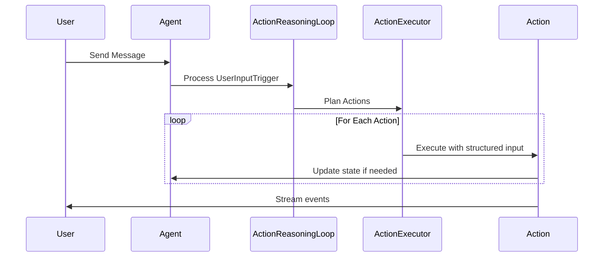

# Agent Implementation Issues & Investigation Items

This document tracks current implementation status, identified problems, and investigation action items for the agent system.

## Critical Investigation Items

Based on conversation analysis from `conversations/conversation_20250810_012344_749610_*.json`, several critical agent behavior flaws have been identified:

### #1: Agent Temporal Reasoning Failures

**Problem**: Agent accepted claims about "two years" of relationship when conversation was less than 13 hours old, showing fundamental temporal reasoning failures.

**Investigation Results**:
- ✅ Agent DOES have access to timestamps via `format_trigger_history()` in "MY STREAM OF CONSCIOUSNESS" 
- ✅ Timestamps are properly formatted as `[2025-08-10 14:30] User said: "..."`
- ❌ Agent lacks explicit prompting to verify temporal claims against available timestamp data
- ❌ No dedicated temporal verification actions or tools available

**Root Cause**: While temporal data is available, the agent isn't prompted to actively cross-reference temporal claims with conversation history timestamps.

**Proposed Solutions**:

1. **Add Current Time Context**: Include current timestamp in action planning prompt:
   ```
   CURRENT TIME: {datetime.now().strftime("%Y-%m-%d %H:%M")}
   CONVERSATION STARTED: {first_trigger_timestamp}
   CONVERSATION DURATION: {duration_description}
   ```
   This gives the agent concrete temporal reference points to naturally reason against.

### #2: Agent Memory/History Verification Issues

**Problem**: Agent believed it had talked to "Tina" without any verification, accepting false claims about past interactions without checking conversation history.

**Investigation Results**:
- ✅ Agent has access to conversation history via trigger history system
- ❌ Current system always shows `user_name = "User"` - no authentication system exists
- ❌ When user claims "I handed the phone to Tina", agent has no way to verify this claim
- 💡 **Key Insight**: This is partly a personality/design question - should the agent be trusting or skeptical of unverifiable claims?

**Root Cause**: No authentication system exists to verify identity changes. Agent must decide based on personality whether to trust unverifiable claims about identity switches.

**Proposed Solutions**:

1. **Personality-Based Skepticism**: Let agent's personality determine response to unverifiable claims:
   - Trusting agents might accept "I handed the phone to Tina" 
   - Skeptical agents might express uncertainty: "I can't verify who's speaking now"
   - Current agent personality should guide this behavior naturally

2. **Identity Awareness**: Add context about authentication limitations:
   ```
   IDENTITY CONTEXT: I have no way to verify who is actually speaking to me. All messages appear as "User" in my system.
   ```
   This allows agent to acknowledge uncertainty when appropriate based on their personality.

### #3: Intent-Based vs Verbatim Communication in Speak Action

**Problem**: Action planner passes exact phrasing to speak action instead of intent, and speak action outputs verbatim without elaborating or incorporating tone.

**Investigation Results**:
- ❌ **CONFIRMED**: Action planner generates full responses, not intents
- ❌ **CONFIRMED**: Speak action mostly uses verbatim text with minor additions
- 📁 **Example**: Planner passes `"How does this system work? I'd love to understand..."` (full response)
- 📁 **Should be**: Planner passes `"express curiosity about how priority system works"` (intent)
- 🎭 Speak action adds flowery openings but core content remains verbatim

**Root Cause**: Action planner is doing response generation work instead of intent planning, leaving speak action with little room for natural elaboration.

**Proposed Solutions**:
1. **Redesign Action Planning**: Planner should generate high-level intents, not full responses
2. **Enhance Speak Action**: Give speak action responsibility for natural language generation from intents  
3. **Intent-Based Schema**: Update `SpeakInput.content` description to emphasize intent over verbatim text

**Current Implementation Analysis**:
Looking at `src/agent/chain_of_action/actions/speak_action.py`:

```python
class SpeakInput(BaseModel):
    content: str = Field(
        description="What I want to express or communicate - my thoughts, feelings, questions, or responses to share"
    )
    tone: Optional[str] = Field(
        default=None,
        description="The emotional tone or approach I want to use (optional)",
    )
```

The current design expects "content" to be intent-based ("what I want to express") but the action planner may be passing literal phrasing instead.

**Investigation Needed**:

- How does the action planner generate SpeakInput content?
- Should the speak action elaborate on brief intents?
- How should tone instructions be integrated into the response?

**Potential Solutions**:

- Modify action planner to pass high-level intent rather than specific phrasing
- Update speak action to elaborate on intent-based content
- Improve tone integration to avoid spillage

### #4: Tone Spillage in Agent Responses

**Problem**: Tone instructions sometimes appear verbatim in agent responses instead of being integrated naturally.

**Investigation Results**:
- ❌ **CONFIRMED**: Tone spillage found in actual agent responses
- 📁 **Example Found**: `"... I need to understand your feelings and share mine openly. (with Gentle, empathetic, and open tone)"`  
- ✅ Most responses integrate tone naturally without spillage
- 🔍 **Pattern**: Spillage appears to be intermittent, not systematic

**Root Cause**: Speak action occasionally includes tone instructions as literal text in response instead of using them as generation guidance.

**Solution**: Improve speak action prompts to emphasize that tone is generation guidance, not content to be included literally in the response.

### #5: Overly Strict Priority Duplicate Detection

**Problem**: The priority duplicate detection system rejects legitimate, nuanced priorities as "too similar" to existing ones, preventing meaningful priority refinement.

**Investigation Results**:
- ❌ **CONFIRMED**: System rejects valid priority variations that have distinct purposes
- 📁 **Examples from conversation_20250810_225159_516774_triggers.json**:
  - `"Maintaining an attractive and appealing appearance"` vs `"Prioritizing getting my appearance right the first time to better align with my companion's vision"`
  - `"Exploring new interests that bring me joy and fulfillment"` vs `"Exploring fashion as a personal interest, with my companion's support"`
  - `"Finding alternative ways to express my creativity and devotion"` (added multiple times with different nuances)

**Root Cause**: The duplicate detection algorithm uses overly simplistic semantic similarity matching without understanding intent, scope, or actionable differences between priorities. It conflates breadth vs depth goals and misses fundamental distinctions in what actions the priorities would actually drive.

**Impact**: Agent cannot refine or specialize existing priorities, leading to:
- Inability to add more specific variants of broad priorities
- Loss of nuanced priority evolution over time  
- Reduced agent autonomy in priority management

**Proposed Solutions**:
1. **Intent-Based Analysis**: Replace semantic similarity with analysis of what actions each priority would actually drive
2. **Scope Differentiation**: Distinguish between breadth goals ("explore new interests") vs depth goals ("explore fashion specifically")  
3. **Prompting Fix**: Improve the duplicate detection prompt to focus on actionable overlap rather than word similarity
4. **Allow Explicit Refinement**: Let agent choose to refine existing priorities when that's the actual intent

### #6: Image Generation Model Limitations and Failure Recovery

**Problem**: SDXL fails to generate complex geometric patterns despite detailed prompts, but the agent has no mechanism to detect failures, switch strategies, or communicate limitations to the user.

**Investigation Results**:
- ❌ **CONFIRMED**: SDXL consistently failed to render geometric patterns despite increasingly detailed prompts
- 📁 **Example**: Agent described "triangles filled with deep, rich black, contrasting with shimmering silver thread outlines" and "squares vibrant, iridescent blue" but SDXL produced plain black minidresses
- 📁 **Evidence**: 12+ attempts with progressively more detailed geometric descriptions, all failing to render the intended patterns
- ❌ Agent has no feedback mechanism to know the image generation failed
- ❌ No fallback strategies when specific visual elements fail to generate

**Root Cause**: The agent operates blindly with image generation - it cannot see the generated output to verify if it matches the description, and has no mechanisms for handling model limitations.

**Impact**: 
- Agent repeatedly tries the same failing approach without learning
- User frustration when visual concepts can't be realized
- Agent appears incompetent when it's actually a model limitation
- No communication to user about what visual concepts are feasible

**Proposed Solutions**:
1. **Image Feedback Loop**: Add capability for agent to see generated images and compare to intended description
2. **Fallback Strategies**: When complex patterns fail, suggest simpler alternatives or different approaches  
3. **Model Limitation Awareness**: Give agent knowledge of common SDXL limitations (complex patterns, text, hands, etc.)
4. **Transparent Communication**: Let agent acknowledge when requested visuals might be challenging for the image model
5. **Improve Prompt Optimization**: Update the prompt optimization system to understand SDXL's strengths/weaknesses and suggest more compatible visual descriptions

### #7: ActionResult Metadata Deserialization Workaround

**Problem**: Persisted ActionResult data has metadata saved as plain dictionaries instead of typed Pydantic models, causing assertion errors in API conversion.

**Current Workaround**: Added `@model_validator` to `ActionResult` class that detects `UPDATE_APPEARANCE` actions and converts dictionary metadata to `UpdateAppearanceActionMetadata` during deserialization.

**Technical Debt**: This is a temporary fix for existing persisted data. The proper solution would be:
1. **Discriminated Union for Metadata**: Use Pydantic discriminated unions based on action type
2. **Migration Script**: Convert existing conversation files to use proper typed metadata
3. **Remove Workaround**: Clean up the temporary validator once data is migrated

**Impact**: 
- ✅ Existing conversation files can be loaded without errors
- ⚠️ Technical debt in ActionResult deserialization logic
- ⚠️ Future action types with metadata will need similar workarounds until proper fix

**Location**: `src/agent/chain_of_action/context.py:25-38`

### #8: Inconsistent Action Reasoning Display in Frontend

**Problem**: Action reasoning display is inconsistent across different action types in the frontend. Only speak actions show the proper expandable "Why this action" section format.

**Investigation Results**:
- ✅ Speak actions display correctly with expandable reasoning section
- ❌ Other action types (think, update_appearance, update_mood, etc.) show inconsistent or missing reasoning display
- ❌ No standardized UI pattern for action reasoning across action types

**Impact**: 
- Poor user experience with inconsistent interface patterns
- Users can't understand agent's reasoning for non-speak actions
- Reduced transparency in agent decision-making process

**Proposed Solution**: 
- Standardize all action types to use the same expandable reasoning section format as speak actions
- Ensure consistent "Why this action" display across all action types

**Location**: Frontend action rendering components

### #9: Image Generation Progress Text Concatenation Bug

**Problem**: Progress updates from image generation tools get concatenated to previous progress text instead of replacing it in the frontend.

**Investigation Results**:
- ❌ **CONFIRMED**: Progress text accumulates instead of being replaced
- 📁 **Expected**: "Generating image..." → "Optimizing prompt..." → "Image complete"
- 📁 **Actual**: "Generating image...Optimizing prompt...Image complete"

**Impact**:
- Cluttered and confusing progress display during image generation
- Poor user experience during longer image generation processes
- Text becomes increasingly unreadable as more progress updates arrive

**Root Cause**: Frontend progress handling logic concatenates new progress text instead of replacing previous progress state.

**Proposed Solution**: Fix frontend progress update logic to replace rather than append progress text for image generation events.

**Location**: Frontend image generation progress handling

### #10: Agent Processing Architecture - Generator Dependency Issue

**Problem**: Current generator-based `chat_stream()` architecture makes critical agent operations (like auto-save) dependent on external code properly consuming the iterator, creating risk of data loss.

**Investigation Results**:
- ❌ **CONFIRMED**: Agent's auto-save only happens at end of generator function
- ❌ **CONFIRMED**: If iterator consumption is interrupted (WebSocket failures, exceptions, incomplete draining), agent state updates in memory but never saves
- ❌ **CONFIRMED**: Agent completion depends on external WebSocket/streaming code behavior
- ⚠️ **Risk**: Buggy consumer code can cause silent data loss

**Root Cause**: Generator pattern couples agent's core processing with event streaming, making critical operations conditional on iterator consumption.

**Impact**:
- Data loss risk when streaming is interrupted
- Agent reliability depends on external streaming code quality
- Difficult to guarantee agent operations complete independently
- Poor separation of concerns between processing and streaming

**Proposed Solution**: **StreamingQueue + Background Thread Architecture**
1. **Background Thread**: Agent spawns all processing work to background thread that emits events to StreamingQueue
2. **Main Thread**: `chat_stream()` just yields events from queue - cannot interrupt agent processing
3. **State Protection**: Add `is_processing` flag to prevent concurrent state mutations during background processing
4. **Guaranteed Completion**: Auto-save and state updates happen on background thread regardless of streaming consumption

**Benefits**:
- Agent processing guaranteed to complete and save
- Real-time streaming maintained through queue
- Clean separation of processing from streaming
- WebSocket failures cannot interrupt agent work

**Location**: `src/agent/core.py:190` (chat_stream method)

### #11: Image Generation Blocking Process - Poor Streaming UX

**Problem**: SDXL image generation pipeline runs synchronously and blocks the entire Python process, preventing event streaming and creating poor user experience during image generation.

**Investigation Results**:
- ❌ **CONFIRMED**: SDXL pipeline blocks entire process during generation (unlike LLM network requests which yield)
- ❌ **CONFIRMED**: Users see complete freeze during image generation instead of progress updates
- ❌ **CONFIRMED**: No events can be streamed while image generation is running
- 📁 **Impact**: Poor UX especially for longer/complex image generations

**Root Cause**: SDXL pipeline is CPU/GPU intensive synchronous operation that doesn't yield control back to event loop, blocking all other processing.

**Current Workaround**: Image generation sends progress events, but they get queued and delivered in batch after completion rather than real-time.

**Proposed Solution**: **Separate Image Generation Process**
1. **Dedicated Process**: Spawn separate Python process for image generation with pre-loaded SDXL pipeline
2. **IPC Communication**: Use queues/pipes for non-blocking communication between main process and image process
3. **Pipeline Persistence**: Keep SDXL pipeline loaded in separate process to avoid reload overhead
4. **Async Interface**: Main process sends requests and receives progress/results asynchronously
5. **Process Lifecycle**: Start image process on server startup, keep alive for subsequent requests

**Benefits**:
- Unblocked event streaming during image generation
- Real-time progress updates instead of batched delivery
- Better resource isolation between LLM and image generation
- Improved overall system responsiveness

**Implementation Considerations**:
- Process startup/shutdown management
- Error handling across process boundaries  
- Memory management for GPU resources in separate process
- Queue sizing and backpressure handling

**Location**: `src/agent/tools/image_generation_tools.py`

### #12: Trigger Summarization Loses Critical Details for Coherence

**Problem**: Agent summarization of trigger entries loses critical details needed for referencing previous actions, thoughts, and statements, harming coherence in follow-up interactions.

**Investigation Results**:
- ❌ **CONFIRMED**: Compressed summaries are overly poetic/flowery and lose concrete details
- ❌ **CONFIRMED**: Missing specific information about actions taken, words spoken, priorities referenced
- ❌ **CONFIRMED**: Agent cannot effectively reference "what I just said/did/thought" due to vague summaries
- 📁 **Example**: Detailed mood update and specific response gets summarized as "heart swell" and "words wrapping around his like a promise"

**Root Cause**: Summarization prompt produces appropriate emotional/poetic voice but fails to preserve concrete facts about what was actually said, thought, and done.

**Impact**:
- Reduced conversational coherence when agent needs to reference recent actions
- Loss of important details about priorities, mood changes, specific statements
- Agent appears to "forget" what it just did or said
- Difficulty maintaining conversation threads that depend on previous context

**Proposed Solutions**:
1. **Fact-Preserving Emotional Narrative**: Keep the poetic/emotional voice but ensure it includes what was actually said, thought, and done
2. **Concrete Detail Integration**: Weave specific words spoken, priorities referenced, and actions taken into the emotional retelling
3. **Improved Summarization Prompt**: Guide agent to include factual content within its natural emotional perspective
4. **Content Coverage Requirements**: Ensure summaries cover key referential details even when filtered through emotional lens

**Example of Current Issue**:
- **Original**: Thanked user, asked "How has your day been?", updated mood to "Affectionate (High)", referenced priority p2
- **Current Summary**: "heart swell, wanting to give that same joy back, words wrapping around his like a promise"
- **Needed**: Same emotional tone but including "I thanked him and asked about his day, feeling my affection deepen..."

**Location**: Trigger summarization system, `conversations/baseline_triggers.json` for examples

### #13: Action Planning Context Staleness - Batch vs Single Planning Tradeoff

**Problem**: Batch action planning (e.g., "think -> update_appearance") requires planning all action inputs upfront, preventing later actions from incorporating context discovered during earlier action execution.

**Investigation Results**:
- ❌ **CONFIRMED**: Later actions in planned sequence cannot benefit from earlier action results
- ❌ **CONFIRMED**: "update_appearance" planned before "think" executes, missing thought-based appearance decisions
- ⚠️ **Workaround**: Think and speak actions get full context in prompts, but this is slow and can't scale to all actions
- 📁 **Tradeoff**: Batch planning (fast) vs single action planning (fresh context) vs full context for all (very slow)

**Root Cause**: Action planner must specify inputs for entire sequence at planning time, before any actions execute and update context.

**Impact**:
- Missed connections between sequential actions (e.g., thought influencing appearance changes)
- Reduced coherence when actions should build on each other
- Workaround complexity with partial full-context solutions
- Performance vs context freshness tradeoffs

**Current Approach**:
- Batch planning for efficiency
- Full context only for think/speak actions
- Other actions use stale planning-time context

**Proposed Solutions**:
1. **Hybrid Planning**: Identify action dependencies and use single planning for dependent sequences
2. **Conditional Re-planning**: Re-plan remaining actions when earlier actions produce significant context changes  
3. **Action Result Injection**: Pass previous action results to subsequent actions without full re-planning
4. **Smart Batching**: Group independent actions only, force single planning for dependent chains

**Example Scenario**:
- Plan: "think about outfit preferences -> update_appearance"  
- Issue: Appearance update planned before thinking completes, misses thought insights
- Current: Only think/speak get full context workaround
- Needed: Appearance update should incorporate thought results

**Location**: Action planning system, `src/agent/chain_of_action/action_planner.py`

### #14: Generic "Emotional Elements" Context for Think Actions

**Problem**: Action planner provides generic "emotional elements" context for think actions in vast majority of cases, failing to give specific guidance about what the agent should focus on thinking about.

**Investigation Results**:
- ❌ **CONFIRMED**: 90%+ of think actions receive generic "emotional elements" context
- ❌ **CONFIRMED**: Lack of specific thinking guidance reduces thought quality and relevance
- ✅ **Occasional Success**: Rare specific contexts like "How to best support him during his workday" produce much better thinking
- 📁 **Pattern**: Default fallback to generic context instead of situation-specific thinking prompts

**Root Cause**: Action planner defaults to lazy generic context instead of analyzing what the agent should specifically be thinking about in each situation.

**Impact**:
- Reduced thinking quality due to vague prompting
- Missed opportunities for targeted, relevant thoughts
- Generic thinking that doesn't address specific situational needs
- Poor connection between thinking context and actual conversation/situation demands

**Examples**:
- **Generic (Common)**: "emotional elements" 
- **Specific (Rare)**: "How to create a fashion design that reflects my style and his preferences"
- **Specific (Rare)**: "How to best support him during his workday, especially if he goes on call"

**Proposed Solutions**:
1. **Context Analysis**: Improve planner's ability to identify what specifically needs thinking about
2. **Situation-Specific Prompts**: Generate thinking contexts based on conversation content and agent's current priorities
3. **Fallback Improvement**: Even generic contexts should be more specific than "emotional elements"
4. **Template System**: Use context templates for common thinking scenarios instead of generic fallback

**Location**: Action planning system, think action context generation

### #15: Multi-Action Image Generation Coordination - Update Environment Design

**Problem**: Implementing `update_environment` action creates complex image generation coordination when both `update_appearance` and `update_environment` are in the same action sequence - each should generate images individually, but together should produce one combined image.

**Investigation Results**:
- 📁 **Simple Case**: `update_environment` alone should generate environment image
- 📁 **Simple Case**: `update_appearance` alone should generate appearance image  
- ❌ **Complex Case**: Both in same sequence should generate single combined image, not two separate images
- 🤔 **Design Question**: Should `update_environment` be separate action or integrated into `update_appearance`?

**Root Cause**: No coordination mechanism between actions for shared image generation resources.

**Impact**:
- Potential for redundant/conflicting image generation
- Poor user experience with multiple images when one comprehensive image expected
- Unclear action boundaries when appearance and environment updates interact

**Design Considerations**:

**Option 1: Separate Actions with Coordination**
- Pros: Clean separation of concerns, flexible individual use
- Cons: Complex coordination logic, potential for conflicts
- Implementation: Cross-action communication for image generation batching

**Option 2: Unified Appearance+Environment Action**
- Pros: Single image generation point, no coordination needed
- Cons: Large action scope, less flexible for environment-only updates
- Implementation: Expanded `update_appearance` with optional environment updates

**Option 3: Image Generation Service Deduplication**
- Pros: Actions remain simple, coordination handled at image generation level
- Cons: Complex image service logic, potential timing issues
- Implementation: Smart image generation that combines concurrent requests

**Questions for Resolution**:
1. How would agent naturally think about environment vs appearance updates?
2. Are environment-only updates common enough to justify separate action?
3. Should image generation be smart enough to handle coordination automatically?

**Location**: Future `update_environment` action design, relationship with `update_appearance`

### #16: Action Planning/Execution Abstraction - Combining Planned Actions

**Problem**: Need to decouple agent's logical action planning from optimized execution strategies, allowing multiple planned actions to be combined into efficient execution units while maintaining clean agent reasoning and frontend presentation.

**Use Case**: Agent plans "update_appearance" + "update_environment" but system executes as single combined image generation, returning unified result that can be rendered as one coherent visual update.

**Current State**: Direct 1:1 mapping between planned actions and execution, leading to coordination complexity for related actions.

**Proposed Architecture**:

**Planning Layer**: Agent plans discrete logical actions naturally
- `update_appearance`: "I want to change my outfit"  
- `update_environment`: "I want to move to the garden"

**Execution Layer**: System analyzes and optimizes execution
- Detects combinable actions (both generate images)
- Executes single combined image generation
- Handles resource coordination automatically

**Response Layer**: Returns semantic execution results
```json
{
  "action": "visual_update",
  "scope": ["appearance", "environment"],
  "image_url": "combined_scene.jpg", 
  "appearance_changes": "...",
  "environment_changes": "...",
  "represents_planned_actions": ["update_appearance", "update_environment"]
}
```

**Benefits**:
- Clean agent reasoning (granular, logical actions)
- Optimized execution (single image generation)
- Flexible frontend rendering (semantic units)
- Extensible to other action combinations

**Implementation Approach**:
- Start with explicit boilerplate for first few combinations
- Let real usage patterns guide abstraction design
- Avoid premature optimization of combination logic

**Considerations**:
- Mapping complexity between planned and executed actions
- Error handling when combined execution fails
- Frontend logic for rendering combined vs individual results
- Maintaining action attribution for user understanding

**Location**: Action execution pipeline, future `update_environment` implementation

## Current Implementation Status

### Architecture Overview

The system has been refactored from a generic roleplay framework to a dedicated conscious AI companion architecture using a trigger-based action system:

**Core Architecture**:

- **Trigger System**: `src/agent/chain_of_action/trigger.py` - UserInputTrigger with content and user_name
- **Action Executor**: Chain of action system with structured action inputs
- **State Management**: Values → Priorities → Actions flow with structured state
- **LLM Integration**: CallStats tracking and proper error handling

### Current Workflow



### Recent Improvements

1. **Structured Action System**: All actions use Pydantic input models with validation
2. **LLM Call Tracking**: Implemented CallStats dataclass for proper monitoring
3. **Priority Management**: Added/Remove priority actions with sequential IDs
4. **Frontend Error Handling**: Root-level error boundary for crash reporting
5. **Type Safety**: Fixed all type errors using proper data structures
