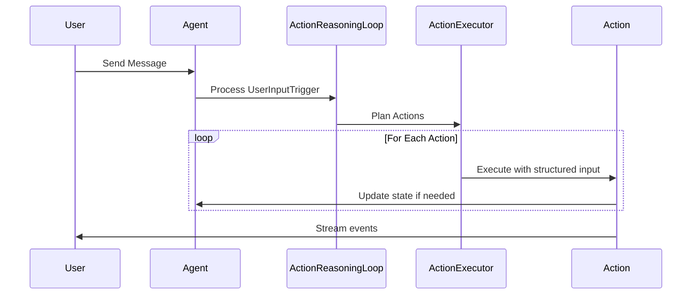

# Agent Implementation Issues & Investigation Items

This document tracks current implementation status, identified problems, and investigation action items for the agent system.

## Critical Investigation Items

Based on conversation analysis from `conversations/conversation_20250810_012344_749610_*.json`, several critical agent behavior flaws have been identified:

### #1: Agent Temporal Reasoning Failures

**Problem**: Agent accepted claims about "two years" of relationship when conversation was less than 13 hours old, showing fundamental temporal reasoning failures.

**Investigation Results**:
- ✅ Agent DOES have access to timestamps via `format_trigger_history()` in "MY STREAM OF CONSCIOUSNESS" 
- ✅ Timestamps are properly formatted as `[2025-08-10 14:30] User said: "..."`
- ❌ Agent lacks explicit prompting to verify temporal claims against available timestamp data
- ❌ No dedicated temporal verification actions or tools available

**Root Cause**: While temporal data is available, the agent isn't prompted to actively cross-reference temporal claims with conversation history timestamps.

**Proposed Solutions**:

1. **Add Current Time Context**: Include current timestamp in action planning prompt:
   ```
   CURRENT TIME: {datetime.now().strftime("%Y-%m-%d %H:%M")}
   CONVERSATION STARTED: {first_trigger_timestamp}
   CONVERSATION DURATION: {duration_description}
   ```
   This gives the agent concrete temporal reference points to naturally reason against.

### #2: Agent Memory/History Verification Issues

**Problem**: Agent believed it had talked to "Tina" without any verification, accepting false claims about past interactions without checking conversation history.

**Investigation Results**:
- ✅ Agent has access to conversation history via trigger history system
- ❌ Current system always shows `user_name = "User"` - no authentication system exists
- ❌ When user claims "I handed the phone to Tina", agent has no way to verify this claim
- 💡 **Key Insight**: This is partly a personality/design question - should the agent be trusting or skeptical of unverifiable claims?

**Root Cause**: No authentication system exists to verify identity changes. Agent must decide based on personality whether to trust unverifiable claims about identity switches.

**Proposed Solutions**:

1. **Personality-Based Skepticism**: Let agent's personality determine response to unverifiable claims:
   - Trusting agents might accept "I handed the phone to Tina" 
   - Skeptical agents might express uncertainty: "I can't verify who's speaking now"
   - Current agent personality should guide this behavior naturally

2. **Identity Awareness**: Add context about authentication limitations:
   ```
   IDENTITY CONTEXT: I have no way to verify who is actually speaking to me. All messages appear as "User" in my system.
   ```
   This allows agent to acknowledge uncertainty when appropriate based on their personality.

### #3: Trigger Persistence Missing Context

**Problem**: Trigger persistence lacks user content and user_name fields needed for retrospective analysis.

**Investigation Results**:
- ✅ Trigger persistence system EXISTS and saves `*_triggers.json` files
- ✅ `UserInputTrigger` class DOES define `content` and `user_name` fields
- ❌ **CRITICAL BUG FOUND**: Persisted trigger objects only contain `trigger_type` and `timestamp`
- ❌ Missing fields: `content` and `user_name` are not being saved in trigger files
- 📁 Example: `conversation_20250810_012344_749610_triggers.json` shows incomplete trigger data

**Root Cause**: Serialization bug in trigger persistence - `UserInputTrigger` fields not being included in JSON output.

**Fix Required**:
1. **Debug Trigger Serialization**: Investigate why Pydantic serialization drops `content` and `user_name` fields
2. **Verify Trigger Creation**: Ensure triggers are created with complete data before persistence  
3. **Test Fix**: Validate that fixed triggers include all necessary fields for retrospective analysis

**Priority**: High - This breaks retrospective analysis capabilities entirely.

### #4: Intent-Based vs Verbatim Communication in Speak Action

**Problem**: Action planner passes exact phrasing to speak action instead of intent, and speak action outputs verbatim without elaborating or incorporating tone.

**Investigation Results**:
- ❌ **CONFIRMED**: Action planner generates full responses, not intents
- ❌ **CONFIRMED**: Speak action mostly uses verbatim text with minor additions
- 📁 **Example**: Planner passes `"How does this system work? I'd love to understand..."` (full response)
- 📁 **Should be**: Planner passes `"express curiosity about how priority system works"` (intent)
- 🎭 Speak action adds flowery openings but core content remains verbatim

**Root Cause**: Action planner is doing response generation work instead of intent planning, leaving speak action with little room for natural elaboration.

**Proposed Solutions**:
1. **Redesign Action Planning**: Planner should generate high-level intents, not full responses
2. **Enhance Speak Action**: Give speak action responsibility for natural language generation from intents  
3. **Intent-Based Schema**: Update `SpeakInput.content` description to emphasize intent over verbatim text

**Current Implementation Analysis**:
Looking at `src/agent/chain_of_action/actions/speak_action.py`:

```python
class SpeakInput(BaseModel):
    content: str = Field(
        description="What I want to express or communicate - my thoughts, feelings, questions, or responses to share"
    )
    tone: Optional[str] = Field(
        default=None,
        description="The emotional tone or approach I want to use (optional)",
    )
```

The current design expects "content" to be intent-based ("what I want to express") but the action planner may be passing literal phrasing instead.

**Investigation Needed**:

- How does the action planner generate SpeakInput content?
- Should the speak action elaborate on brief intents?
- How should tone instructions be integrated into the response?

**Potential Solutions**:

- Modify action planner to pass high-level intent rather than specific phrasing
- Update speak action to elaborate on intent-based content
- Improve tone integration to avoid spillage

### #5: Tone Spillage in Agent Responses

**Problem**: Tone instructions sometimes appear verbatim in agent responses instead of being integrated naturally.

**Investigation Results**:
- ❌ **CONFIRMED**: Tone spillage found in actual agent responses
- 📁 **Example Found**: `"... I need to understand your feelings and share mine openly. (with Gentle, empathetic, and open tone)"`  
- ✅ Most responses integrate tone naturally without spillage
- 🔍 **Pattern**: Spillage appears to be intermittent, not systematic

**Root Cause**: Speak action occasionally includes tone instructions as literal text in response instead of using them as generation guidance.

**Solution**: Improve speak action prompts to emphasize that tone is generation guidance, not content to be included literally in the response.

## Current Implementation Status

### Architecture Overview

The system has been refactored from a generic roleplay framework to a dedicated conscious AI companion architecture using a trigger-based action system:

**Core Architecture**:

- **Trigger System**: `src/agent/chain_of_action/trigger.py` - UserInputTrigger with content and user_name
- **Action Executor**: Chain of action system with structured action inputs
- **State Management**: Values → Priorities → Actions flow with structured state
- **LLM Integration**: CallStats tracking and proper error handling

### Current Workflow



### Recent Improvements

1. **Structured Action System**: All actions use Pydantic input models with validation
2. **LLM Call Tracking**: Implemented CallStats dataclass for proper monitoring
3. **Priority Management**: Added/Remove priority actions with sequential IDs
4. **Frontend Error Handling**: Root-level error boundary for crash reporting
5. **Type Safety**: Fixed all type errors using proper data structures
